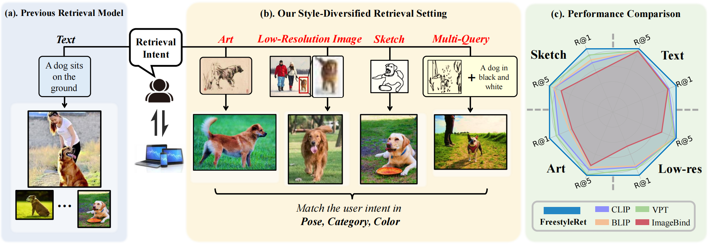
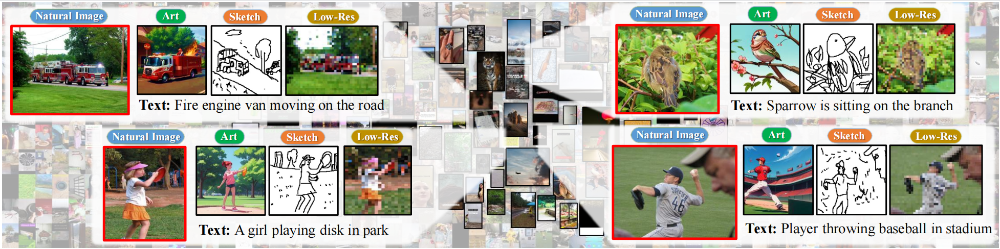
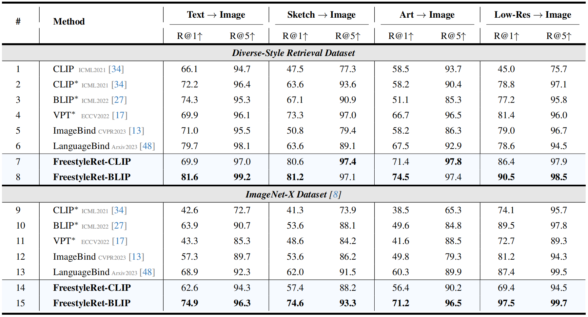
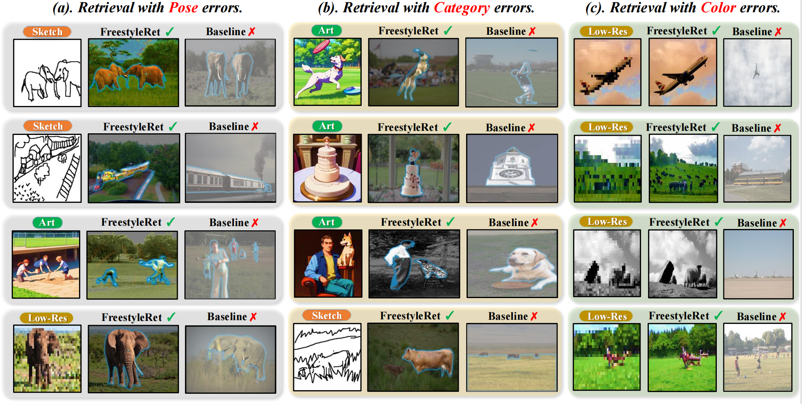

<p align="center">
    
<p>
<h2 align="center"> <a href="">【ECCV 2024 🔥】 FreestyleRet: Retrieving Images from Style-Diversified Queries</a></h2>
<h5 align="center"> If you like our project, please give us a star ⭐ on GitHub for latest update.  </h2>


<h5 align="center">
    
[](https://arxiv.org/abs/2312.02428)
[](https://github.com/YanhaoJia/FreeStyleRet/blob/main/LICENSE)
[](https://github.com/YanhaoJia/FreeStyleRet/blob/main/DATASET_LICENSE) <br>

</h5>


## 📰 News
* **[2025.7.1]** The Uni-Retrieval's expanded version Uni-RAG has been released at [link](https://arxiv.org/abs/2507.03868)!
* **[2025.5.15]** Our new retrieval model Uni-Retrieval has been accepted by ACL 2025!
* **[2024.7.24]** Our Diverse-Style Retrieval Dataset is released at [this](https://huggingface.co/datasets/Curise/FreeStyleRet-DSR).
* **[2024.7.24]** Add a new retreival task evaluator tool with R1 and R5.
* **[2024.7.1]** Our FreestyleRet has been accepted by ECCV 2024!
* **[2023.11.29]**  Code is available now! Welcome to **watch** 👀 this repository for the latest updates.

## 😮 Highlights

### 💡 High performance, plug-and-play, and lightweight
FreestyleRet is **the first multi-style retrieval model** and focus on the precision search field. You can transfer our gram-based style block to **any other pre-trained model** with only **28M** trainable parameters.

### ⚡️ A multi-style, fully aligned and gained dataset
We propose the precision search task and its first corresponding dataset.
Following figure shows our proposed Diverse-Style Retrieval Dataset(**DSR**), which includes five styles: origin, sketch, art, mosaic, and text.

<p align="center">

</p>


## 🚀 Main Results

FreestyleRet achieves **state-of-the-art (SOTA) performance on the DSR dataset and the ImageNet-X dataset**, * donates the results of prompt tuning.
<p align="left">

</p>

## 🤗 Visualization
Each sample has three images to compare the retrieval performance between our FreestyleRet and the BLIP baseline on the DSR dataset.
The left images are the queries randomly selected from different styles. The middle and the right images are the retrieval results of our FreestyleRet-BLIP model and the original BLIP model, respectively.
<p align="left">

</p>


## 🛠️ Requirements and Installation
* Python >= 3.9
* Pytorch >= 1.9.0
* CUDA Version >= 11.3
* Install required packages:
```bash
git clone https://github.com/YanhaoJia/FreeStyleRet
cd FreeStyleRet
pip install -r requirements.txt
```


## 💥 DSR dataset & FreestyleRet Checkpoints
Both [dataset](https://huggingface.co/datasets/Curise/FreeStyleRet-DSR) and [model checkpoints](https://huggingface.co/Curise/FreestyleRet) has been released.

## 🗝️ Training & Validating
The training & validating instruction is in [train.py](train.py) and [test.py](test.py).

## 👍 Acknowledgement
* [OpenCLIP](https://github.com/mlfoundations/open_clip) An open source pretraining framework.
* [LanguageBind](https://github.com/PKU-YuanGroup/LanguageBind) Bind five modalities through Language.
* [ImageBind](https://github.com/facebookresearch/ImageBind) Bind five modalities through Image.
* [FSCOCO](https://github.com/pinakinathc/fscoco) An open source Sketch-Text retrieval dataset.

## 🔒 License
* The majority of this project is released under the MIT license as found in the [LICENSE](https://github.com/YanhaoJia/FreeStyleRet/blob/main/LICENSE) file.
* The dataset of this project is released under the CC-BY-NC 4.0 license as found in the [DATASET_LICENSE](https://github.com/YanhaoJia/FreeStyleRet/blob/main/DATASET_LICENSE) file. 

## ✏️ Citation
If you find our paper and code useful in your research, please consider giving a star :star: and citation :pencil:.

```BibTeX
@inproceedings{li2024freestyleret,
  title={Freestyleret: retrieving images from style-diversified queries},
  author={Li, Hao and Jia, Yanhao and Jin, Peng and Cheng, Zesen and Li, Kehan and Sui, Jialu and Liu, Chang and Yuan, Li},
  booktitle={European Conference on Computer Vision},
  pages={258--274},
  year={2024},
  organization={Springer}
}

@misc{jia2025uniretrievalmultistyleretrievalframework,
      title={Uni-Retrieval: A Multi-Style Retrieval Framework for STEM's Education}, 
      author={Yanhao Jia and Xinyi Wu and Hao Li and Qinglin Zhang and Yuxiao Hu and Shuai Zhao and Wenqi Fan},
      year={2025},
      eprint={2502.05863},
      archivePrefix={arXiv},
      primaryClass={cs.IR},
}

@misc{wu2025queryexplanationuniragmultimodal,
      title={From Query to Explanation: Uni-RAG for Multi-Modal Retrieval-Augmented Learning in STEM}, 
      author={Xinyi Wu and Yanhao Jia and Luwei Xiao and Shuai Zhao and Fengkuang Chiang and Erik Cambria},
      year={2025},
      eprint={2507.03868},
      archivePrefix={arXiv},
      primaryClass={cs.AI},
}
```
